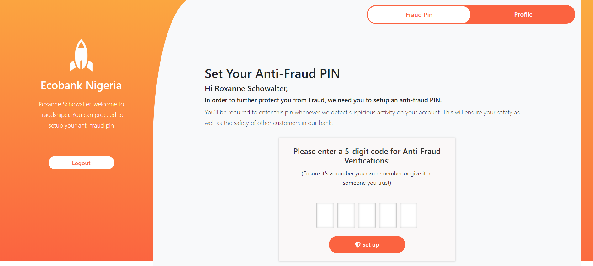

# Anti Fraud Pin

In other to protect from frauds, bank customers are required to setup a 5 digit antifraud pin. 

This pin will be required whenever Fraudsniper detects a suspicious transaction on 
a bank customer's account

