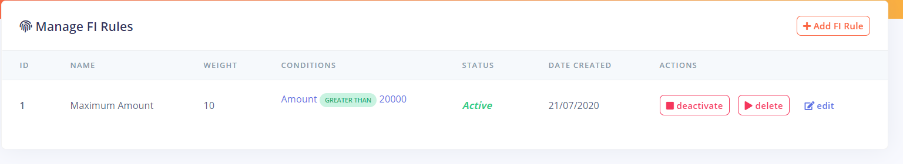
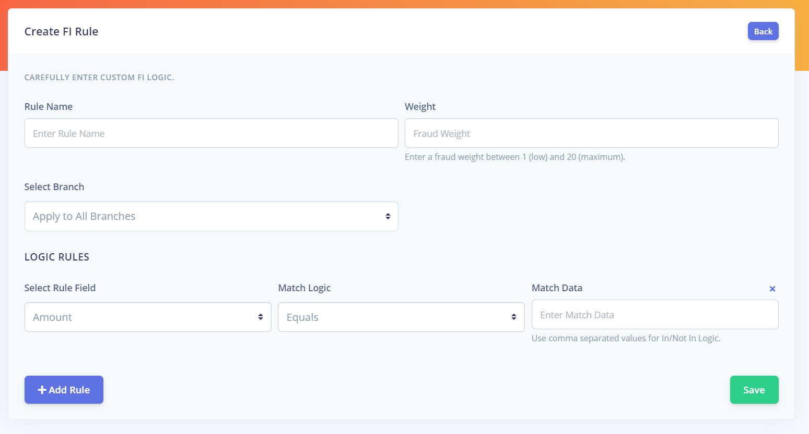
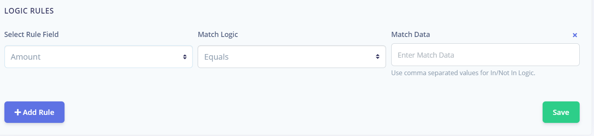
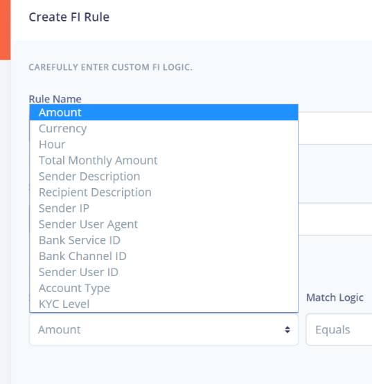
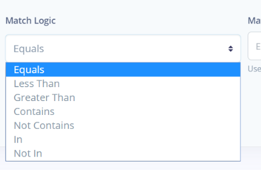

# Fraud Intelligence Rules

Fraud intelligence rules are a set of rules created within Fraudsniper by the bank team to detect 
suspicious transactions on deployed channels of all bank branches.

The bank team can carry out the following operation on a fraud intelligence rule

* Edit
* Activate
* Deactivate
* Delete

## Creating Fraud Intelligence Rules

To create a fraud intelligence rule, the following fields are required by the bank team

* `Rule Name` - A name for the rule.
* `Weight` - The weight of the rule to help decide how suspicious a transaction is. A minimum of 0 and maximum of 20 is required for this field
* `Bank Branch` - Select a branch to apply to rules to. The rule by default applies to all branch of the bank
* `Logic Rules` - The logic that is checked for in transaction to detect if it is suspicious or not

### Logic Rules
 The logic rules are a set of rules defined for the fraud intelligence rule to carry out the check 
 on each transactions. A fraud intelligence rule can have more than one logic rule depending of the 
 specification of the bank team. 
 
 
 
 To create a logic rule, the following fields are required
 
* `Rule Field` 

* `Math Logic`

* `Match Data`
