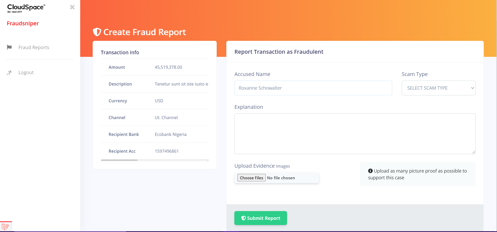
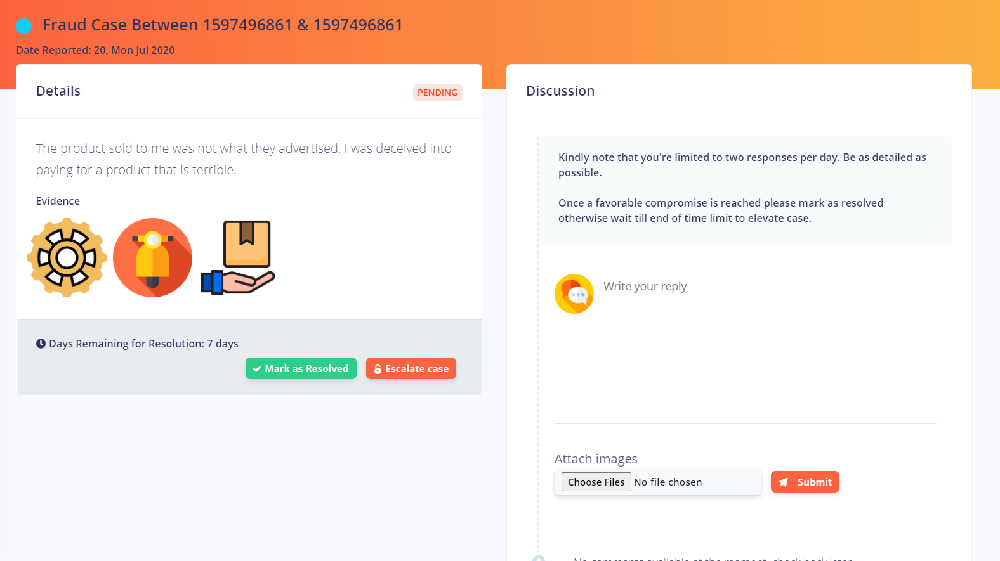
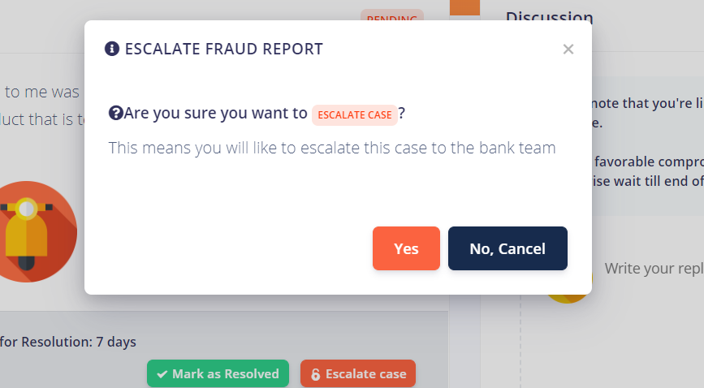
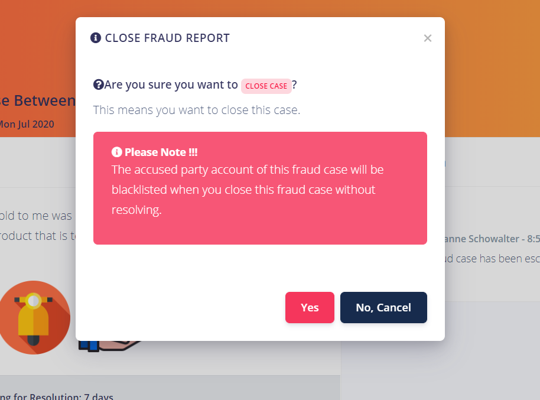

# Fraud Reports/Cases

Bank customers are given the option of reporting transactions as fraudulent by creating
a fraud report through a link provided in the transaction alert email sent to them

## Create Fraud Report
Bank customer report can a transaction as fraud by providing the following information 

* Accused Name
* Scam Type
* Explanation
* Evidence (Images)

An email notification is then sent to the accused party, the sending bank team and receiving bank team of the
money involved during the transaction. The bank customer also receives an email notification to assure them their case has been created successfully.

## Manage Fraud Case/Report
Bank customers can proceed to managing the fraud report with the accused party in the discussion session 
where they can both provided evidences to back their arguments. This is done outside independently of the bank team.

In the event that both parties are not able to come to a conclusion, the accuser can then decide to escalate
the report to the bank team for further investigation and action.

### Fraud Case Escalation
A fraud report escalation is done when a bank customer and the accused party of a fraud report are not able to come to an agreement on 
a fraud case. This case is then forwarded to the bank team, the bank them can then decide to approve the escalation of reject the escalation depending 
on the circumstances surrounding the fraud report.

### Fraud Case Resolved
A fraud can be resolved by either the bank customer if they have been able to arrive at an agreement with the accused party
or by the bank team if proper investigation has been carried out and case has been resolved between both parties. 
Resolving a fraud case usually denoted the end of the fraud case.

### Fraud Case Closure
A fraud case can be closed by the bank team before resolving it, this will lead to the temporary blacklisting
of the accused party account for 7 days. 

By default a 30 days deadline is giving for an accused party to resolve any issue with their account before their account is blacklisted permanently.

