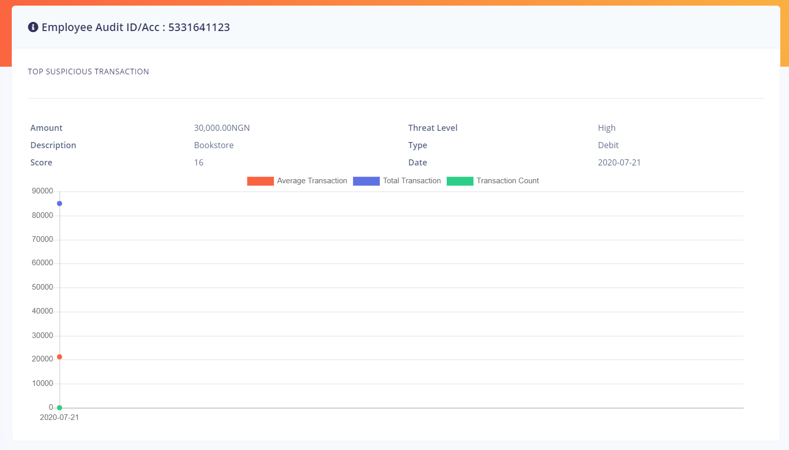

# Transactions

Transactions in Fraudsniper are list of transactions that has been detected as suspicious
and giving a risk score according to the fraud intelligence rules created by the bank team.

Fraudsniper enables the bank team to carry out the following operations with and on transactions

* Audit Customers Transactions
* View Suspicious Transactions Breakdown

## Auditing Customers
A customer can be audited either with their customer id or by their account number. A typical customer audit 
page is shown in the image below

## Suspicious Transaction Breakdown

